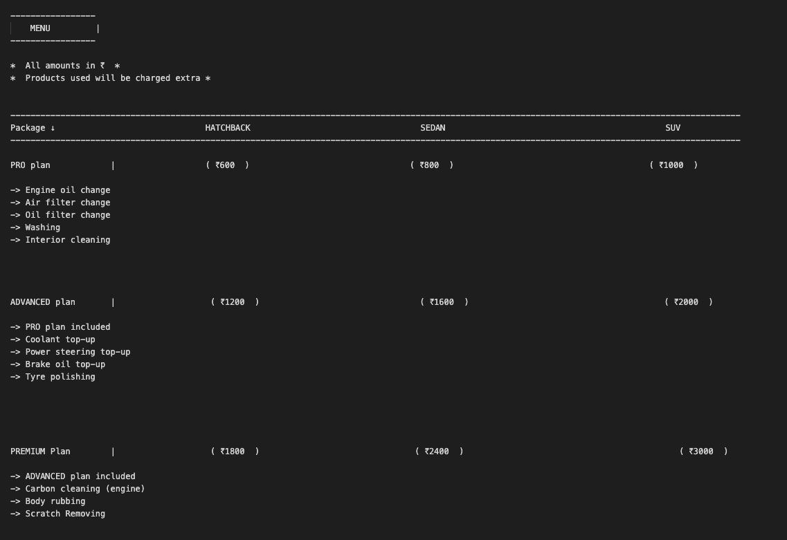

# Car-Service-Booking API

RESTful JSON API for Car Servicing Company using NodeJS, ExpressJS and Mongoose.

## Routes

* User
* Booking
* Review
* Service Center
* Menu

### Users
#### Methods
* POST /user/register
* POST /user/login
* GET /user/logout
* GET /user/info

#### user/POST
##### Path:
```
/user/register
```

##### Parameters:
```
none
```
##### Body:
```
name* (Required)
email* (Required)
password* (Required)
phone* (Required)
city* (Required)
```

##### Headers:
```
none
```

##### Response
```
{   
  "Succesfully Registered"
}
```
##### Errors
```
500: Required fields missing or they were invalid
400: Phone number should be 10 digits
400: Password should be atleast 6 characters long
400: This user does not exist
```

#### user/POST
##### Path:
```
/user/login
```

##### Parameters:
```
none
```
##### Body:
```
email* (Required)
password* (Required)
```

##### Headers:
```
none
```

##### Response
```
{Access Token}
```

##### Errors
```
400: This user does not exist
400: Incorrect password    
500: Required fields missing or they were invalid
```

#### user/GET
##### Path:
```
/user/logout
```

##### Parameters:
```
none
```

##### Response
```
"Logged out"
```

#### User/GET
##### Path:
```
/user/info
```

##### Parameters:
```
none
```

##### Headers:
```
Authorization: {Access Token}
```

##### Response
```
{
    role,
    _id,
    name,
    email,
    phone,
    city,
    createdAt,
    updatedAt,
    __v
}
```
##### Errors
```
400: User does not exist
400: Invalid Authentication
500: Unauthorized access    
```
### Booking
#### Methods
* GET /booking/
* POST /booking/
* PUT /booking/:id
* DELETE /booking/:id

#### Booking/GET
##### Path:
```
/booking/
```
Parameters:
```
none
```
##### Headers:
```
Authorization: {Access Token}
```

##### Response
```
{
   _id,
   userID,
   customer_name,
   customer_email,
   serviceDate,
   serviceLocation,
   nameOfCar,
   carModel,
   carMake,
   carClass,
   package,
   amount,
   createdAt,
   updatedAt,
   __v
}
```
##### Errors
```
400: User does not exist
400: Invalid Authentication
500: Unauthorized Access
```

#### Booking/POST
##### Path:
```
/booking/
```
##### Parameters:
```
none
```
##### Body:
```
serviceDate* (Required),
serviceLocation* (Required),
nameOfCar* (Required),
carModel* (Required),
carMake* (Required),
carClass* (Required),
package* (Required)
```
##### Headers:
```
Authorization: {Access Token}
```
##### Response
```
"Service booked! Total amaount: ${amount}. Have a nice day!"
```

##### Errors
```
500: Required fields missing
400: Currently we don't have a service center at this location. Sorry for inconvenience
400: Currently we don't have facilities for this model at the desired location
400: Invalid Authentication
500: Unauthorized Access
```
#### Booking/DELETE
##### Path:
```
/booking/:id=booking._id
```
##### Parameters:
```
booking._id* (required)
```
##### Headers:
```
Authorization: {Access token}
```

##### Response
```
"Booking Deleted"
```

##### Errors
```    
400: Invalid Authentication
500: Unauthorized Access
```
#### Booking/PUT
##### Path:
```
/booking/:id=booking._id
```

##### Parameters:
```
id* (required)    
```
##### Body:
```
{ 
  serviceDate,
  nameOfCar,
  carModel,
  carMake,
  carClass,
  package
}
```
##### Headers:
```
Authorization: {Access token}
```
##### Response
```
`Booking Updated. New Amount: ${amount}.`
```
##### Errors
```
400: Booking not found    
400: Invalid Authentication
500: Unauthorized Access
```

### Menu
#### Methods
* GET /booking/menu
#### Menu/GET
##### Path:
```
/booking/menu/
```
##### Parameters:
```
none
```
##### Headers:
```
Authorization: {Access token}
```
##### Response


##### Errors
```
400: Invalid Authentication
500: Unauthorized access
```
### Centers
#### Methods
* GET /api/center
* POST /api/center
* PUT /api/center/:id
* DELETE /api/center/:id

#### Centers /GET
##### Path:
```
/api/center
```
##### Parameters:
```
none
```
##### Headers:
```
none
```
##### Response
```
[
   {
      carname: [
        ],
      model: [
        ],
      _id,
      location,
      make,
      createdAt,
      updatedAt,
      __v
    }
]
```
#### Centers /POST
##### Path:
```
/api/center
```
##### Body:
```
{ 
  location,
  make,
  carname,
  model
} 
```
##### Headers:
```
Authorization: {Access Token} (admin only) 
```
##### Response
```
"New service center added"
```
##### Errors
```
400: A service center already exists for this Make at this location    
400: Resource can only be accessed by admin
500: Unauthorized access
500: Missing fields

```
#### Centers /DELETE
##### Path:
```
/api/center/id=center._id
```
##### Parameters:
```
id* (Required)
```
##### Headers:
```
Authorization: {Access Token} (admin only)
```
##### Response
```
Service center deleted
```
##### Errors:
```    
400: Resource can only be accessed by admin
500: Unauthorized access 
400: Invalid Authentication
```
#### Centers /PUT
##### Path:
```
/api/center/id=center._id
```
##### Parameters:
```
id* (Required)
```
##### Headers:
```
Authorization: {Access Token} (admin only)
```
### Response:
```
Update Complete
```
##### Errors
```
400: No such service center found 
400: Resource can only be accessed by admin
500: Unauthorized access 
400: Invalid Authentication
```
### Reviews
#### Methods
* GET /review/
* POST /review/
* DELETE /review/:id
* PUT /review/:id
* GET /review/all
* DELETE /review/all

#### Reviews /GET
##### Path:
```
/review/
```
##### Parameters:
```
none
```
##### Headers:
```
Authorization: {Access Token} (Required)
```
##### Response:
```
[
    {
        content,
        _id,
        authorID,
        author,
        rating,
        date,
        __v
    }
] // specific user reviews only
```
##### Errors:
```
400: Required fields missing
400: User does not exist
500: Unauthorized access 
400: Invalid Authentication
```
#### Reviews /POST
##### Path:
```
/review/
```
##### Parameters:
```
none
```
##### Body:
```
{ 
  rating,
  date,
  content
}
```
##### Headers:
```
Authorization: {Access Token} (Required)
```
##### Response:
```
Review saved
```
##### Errors:
```
400: Required fields missing
400: User does not exist
500: Unauthorized access 
400: Invalid Authentication 
```
#### Reviews /DELETE
##### Path:
```
/review/:id // review id
```
##### Parameters:
```
id* (Required)
```
##### Headers:
```
Authorization: {Access Token} (Required)
```
##### Response:
```
Review deleted
```
##### Errors:
```
500: Unauthorized access 
400: Invalid Authentication
```
##### Reviews /PUT
##### Path:
```
/review/:id // review id
```
##### Parameters:
```
id* (Required)
```
##### Headers:
```
Authorization: {Access Token} (Required)
```
##### Response:
```
Review updated
```
##### Errors:
```
400: Review not found
500: Unauthorized access 
400: Invalid Authentication
```
#### Reviews /GET
##### Path:
```
/review/all
```
##### Parameters:
```
none
```
##### Headers:
```
Authorization: {Access Token} (Required)
```
##### Response:
```
[
    {
        content,
        _id,
        authorID,
        author,
        rating,
        date,
        __v
    }
] // all user reviews
```
##### Errors:
```
500: Unauthorized access 
400: Invalid Authentication
```
#### Reviews /DELETE
##### Path:
```
/review/all
```
##### Parameters:
```
none
```
##### Headers:
```
Authorization: {Access Token} (Required) (admin only)
```
##### Response:
```
All reviews deleted
```
##### Errors:
```
500: Unauthorized access
400: Resource can only be accessed by admin
400: Invalid Authentication
```
